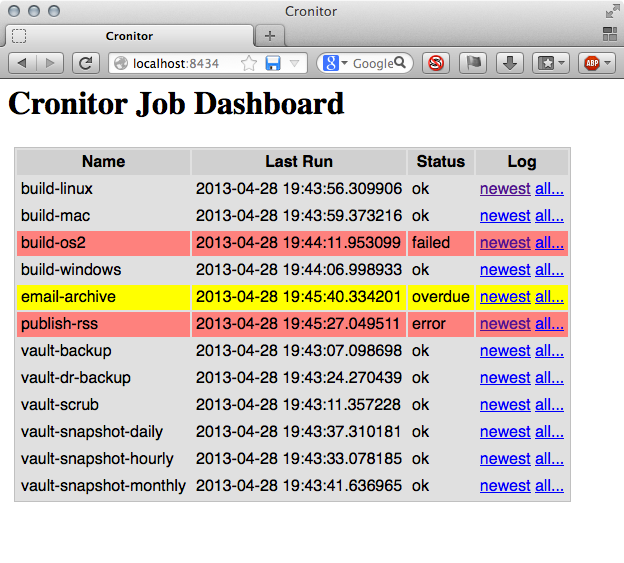

======================================
 Cronitor: Simple Cron-Job Monitoring
======================================
:Author: Joshua J. Berry <des@condordes.net>
:Homepage: https://github.com/josh-berry/cronitor
:License: GNU General Public License, version 3

Introduction
============

Cronitor is a simple HTTP-based service for monitoring and capturing logs from
Cron jobs or other tasks across multiple machines.  It provides a few important
benefits over regular cron emails:

   1. Collect output from all jobs across all machines in one place.
   2. Report job status in a convenient web dashboard, so you can see
      immediately if any jobs failed.
   3. Highlight overdue jobs that didn't run when scheduled.
   4. Scan job output looking for (configurable) error messages.

Cronitor is a client/server system.  The server is a lightweight HTTP server,
which collects logs from jobs as they run on local or remote systems, scans them
for errors and provides a dashboard showing all jobs that were reported.

The client is a simple Python script that runs a job, captures its output and
sends it to the server.  The client script is standalone, requiring only
standard Python 2 libraries to run.  Installing it is as simple as ``scp``.

Dependencies
============

The client requires only a recent version of Python 2.

The server requires the following extra dependencies:

   * `PyYAML` >= 3.10 (``pip install PyYAML``)

     * Known to work with 3.10

   * `Tornado` >= 2.1 (``pip install tornado``)

     * Known to work with 2.1 and 3.0.1

.. PyYAML: https://pypi.python.org/pypi/PyYAML
.. Tornado: https://pypi.python.org/pypi/tornado

Older versions of these packages may work but have been untested.  Newer
versions will most likely work (known-good versions are noted above).

Setting up the Server
=====================

The following instructions are for Linux.  You may need to adapt them to your
specific platform.

   1. Install dependencies:
      ::
         $ pip install PyYAML tornado      # or apt-get, or yum, or ...

   2. Grab the Cronitor repository, and put it somewhere useful:
      ::
         $ git clone git://github.com/josh-berry/cronitor.git /opt/cronitor
         $ cd /opt/cronitor

   3. Create a user/group for the `cronitor-server` process:
      ::
         $ sudo groupadd -r cronitor
         $ sudo useradd -r -s /usr/sbin/nologin -g cronitor \
                        -d /opt/cronitor cronitor

   4. Choose where to store your Cronitor log files:
      ::
         $ emacs /opt/cronitor/server.yaml
         $ mkdir /your/log/dir
         $ chmod u=rwx,go= /your/log/dir
         $ sudo chown cronitor:cronitor /your/log/dir

   5. Set up some rules for the jobs you're running:
      ::
         $ emacs /opt/cronitor/rules.yaml

   6. Configure Cronitor to start when your system does:
      ::
         $ sudo cp /opt/cronitor/init/<your_init_file> /etc/init.d/cronitor
             # This varies by distro; right now only upstart is available.
             # Patches to add more init scripts are welcome. :)

   7. Start Cronitor:
      ::
         $ sudo start cronitor

If you would prefer to store your config, logs, and executable code separately,
a few extra steps are required.

   1. Copy your ``server.yaml`` and ``rules.yaml`` files elsewhere:
      ::
         $ mkdir /etc/cronitor
         $ cp *.yaml /etc/cronitor

   2. Change your ``server.yaml`` file to use absolute paths:
      ::
         job_dir: /var/log/cronitor
         template_dir: /opt/cronitor/templates
         asset_dir: /opt/cronitor/assets

         # Or, if you're lazy, leave these as-is and make symlinks ;)

   3. When you start ``cronitor-server``, pass the location of your
      ``server.yaml`` file with ``-c``:
      ::
         $ cronitor-server -c /etc/cronitor/server.yaml

Setting up a Client
===================

Setting up a client can be as simple as::

  scp cronitor-run user@host:/path/to/a/bin_dir

Then setup your crontab to look like this::

  CRONITOR_URL=http://your.cronitor.server:8434/

  0 1 2 3 4 5 cronitor-run -q -j my-job-name -- do_something --verbose

See ``cronitor-run --help`` for more details about how to invoke it.

A Note About Security
=====================

Since Cronitor uses the lightweight Tornado web server, there is no support for
SSL or authentication of any kind.  You may wish to run your Cronitor server
behind a more full-featured proxy server such as Apache or nginx.

However, ``cronitor-run`` has no support for such mechanisms (yet).  Patches --
especially for ``cronitor-run`` -- are (very) welcome.

For the time being, we suggest you run Cronitor inside a VPN only.

Legalese
========

Cronitor: Simple Cron-Job Monitoring
Copyright 2013 Joshua J. Berry, and others listed in the AUTHORS file

This program is free software: you can redistribute it and/or modify it under
the terms of the GNU General Public License as published by the Free Software
Foundation, either version 3 of the License, or (at your option) any later
version.

This program is distributed in the hope that it will be useful, but WITHOUT ANY
WARRANTY; without even the implied warranty of MERCHANTABILITY or FITNESS FOR A
PARTICULAR PURPOSE.  See the GNU General Public License for more details.

A copy of the GNU General Public License is available in the COPYING file
distributed with this software.  You can also obtain a copy at
http://www.gnu.org/licenses/ .
